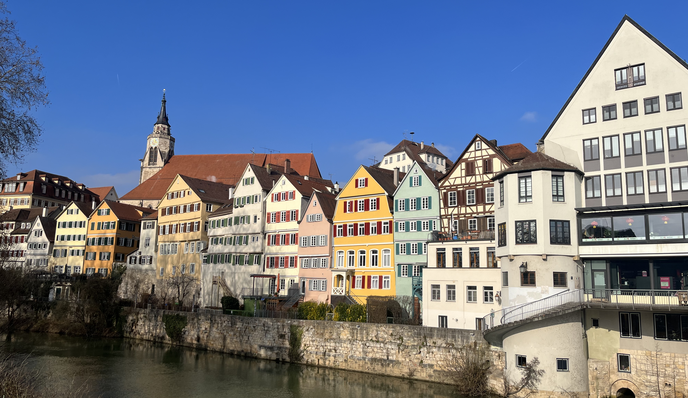

---
# Feel free to add content and custom Front Matter to this file.
# To modify the layout, see https://jekyllrb.com/docs/themes/#overriding-theme-defaults
layout: home
menu: main
---

    

 

Welcome to the Cognitive Science doctoral symposium 2025 on the topic **"Understanding context in cognition"**!

We cordially invite graduate students in Cognitive Science and related disciplines to participate in the Cognitive Science PhD-Symposium on the topic “Understanding Context in Cognition”, a 2.5-day event taking place on April 7–9, 2025, at the University of Tübingen. The symposium hopes to bring together Cognitive Science PhD students from across Germany to delve into the interdisciplinary topic of context, connecting research across domains including event cognition, Artificial Intelligence, linguistics, cognitive modeling, psychology, and education.

PhD students will have opportunities to share their research through presentations, engage in discussions and networking with both peers and leading senior researchers in the field. Featuring invited keynote talks, hands-on workshops on computational cognitive modeling, large language models (LLMs), neurophysiological methods, and grant proposal writing, the symposium will provide opportunities to both strengthen methodological skills, and engage with leading research in the field.

Don't miss this opportunity to engage in collaborative tasks, exchange ideas, and connect with peers to shape the future of Cognitive Science in Germany! Please go to [this page for abstract submission and registration!]({{ site.baseurl }})